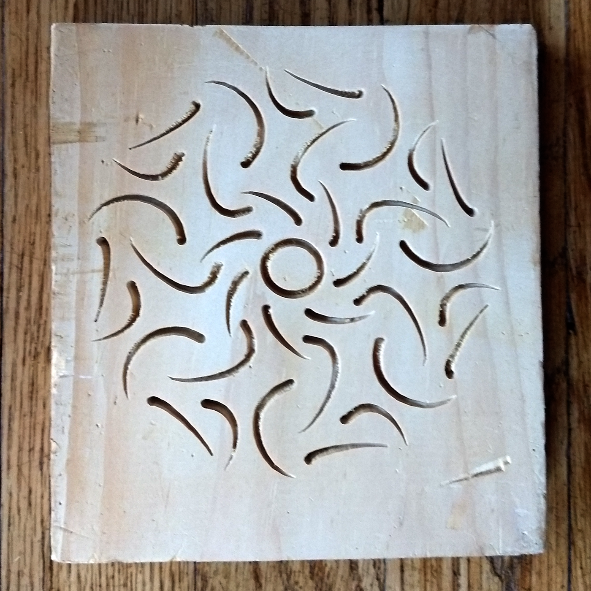

# kaleidocarve
An Electron app for creating radially symmetric patterns.

And then generates G-Code to carve the pattern on a CNC machine with a V groove bit.

## Modules used

* [electron](https://www.electronjs.org/) Electron framework
* [scss](https://sass-lang.com/) CSS preprocessor
* [mocha](https://mochajs.org/) Unittest framework
* [chai](https://www.chaijs.com/) Helpful asserts for Mocha
* [istanbul](https://istanbul.js.org/) Code coverage
