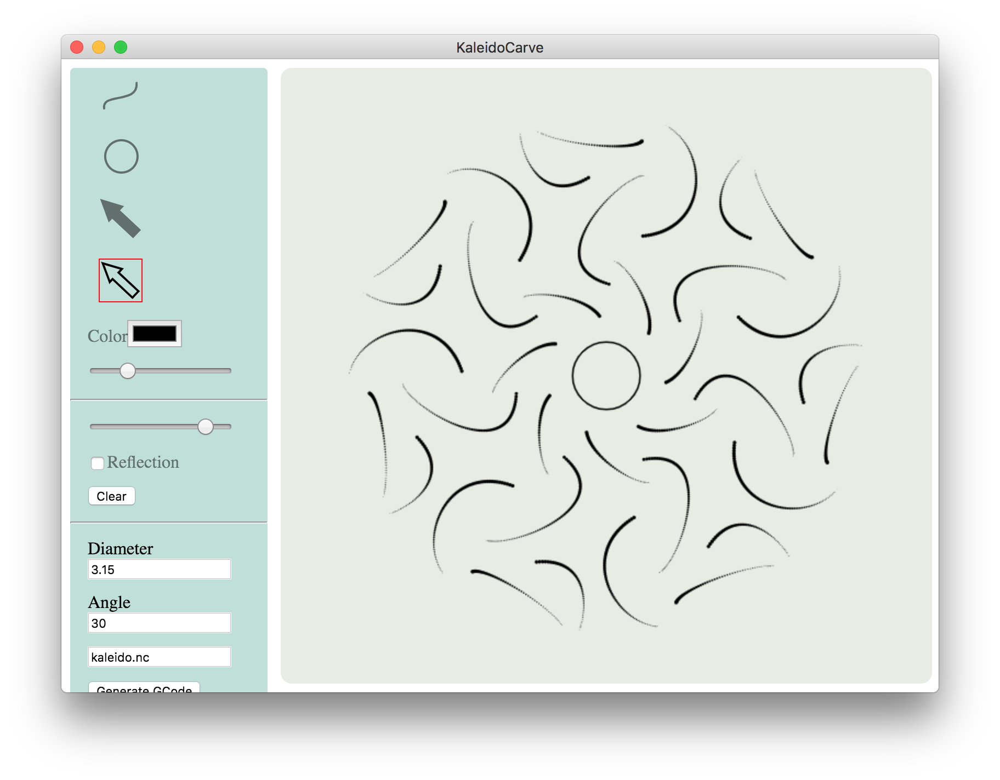

# kaleidocarve
An Electron app for creating radially symmetric patterns.

And then generates G-Code to carve the pattern on a CNC machine with a V groove bit.

## Building
Requires [Node.js](https://nodejs.org/en/).

In top-level directory do `npm install` to download all of the required modules.

Do `npm test` to run the unittests.

### Modules used

* [electron](https://www.electronjs.org/) Electron framework
* [scss](https://sass-lang.com/) CSS preprocessor
* [mocha](https://mochajs.org/) Unittest framework
* [chai](https://www.chaijs.com/) Helpful asserts for Mocha
* [istanbul](https://istanbul.js.org/) Code coverage

Do `npm start` to run the app.

## Running
Do `npm start` to run the app.

The top group of input controls are for drawing curves & circles.

* The  button chooses a mode for drawing cubic Bézier curves.
* The  button chooses a mode for drawing cubic circles.
* The  button chooses a mode for selecting curves.
* The  button chooses a mode for individual control points of a curve.
* The W slider controls the width of the curve. If a single control point is selected, then it controls the width at that point on the curve.

The next group of input controls affect the drawing area. 
* The # slider controls the number of copies of the curves which should be arranged around the center.
* The Reflection checkbox controls whether two mirrored copies of the curves should be included.
* The Grid checkbox controls whether a grid should be displayed.
* The Clear button deletes all of the curves.

The final group of input controls are used to generate G-Code.
* The Φ field is used to set the maximum diameter of the V bit in mm.
* The ∠ field is used to set the angle of the V bit.
* The next field is the name of the generated G-Code file.
* The Generate GCode button will write the current scene to the file.

